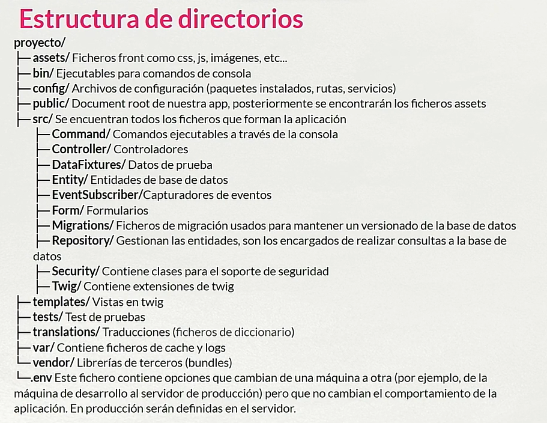
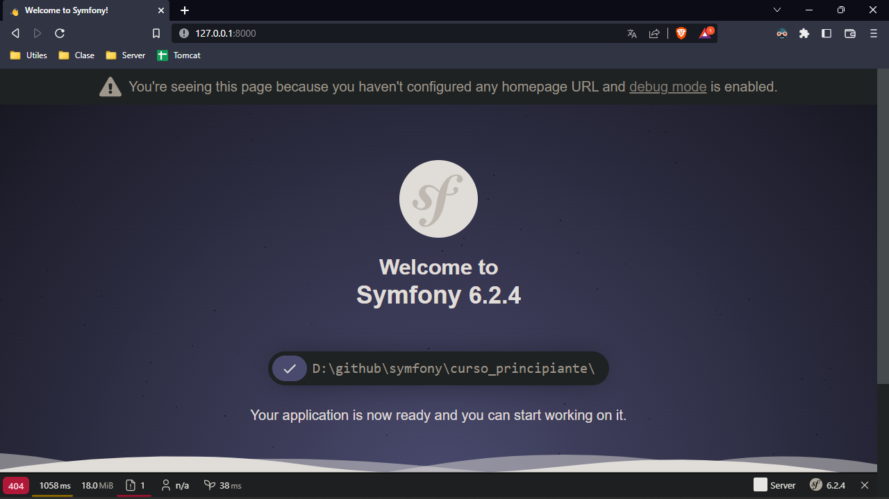

# symfony 5 

# Tabla de contenidos
- [Arrancar un proyecto ya existente](#arrancar-un-proyecto-ya-existente)
- [creacion de un proyecto](#creacion-del-proyecto-e-instalacion-de-componentes)
  - [Crear entidad y repositorio (migration)](#crear-entidad-y-repositorio-migration)
  - [Gestion de la BBDD](#gestion-de-la-bbdd)
  - [generar un controlador](#generar-un-controlador)
  - [Crear un crud](#crear-un-crud)
  - [Usuarios](#usuarios)
    - [Registro](#el-registro)
    - [Login](#el-login)
    - [Roles](#los-roles)
  - [Añadir recursos externos para fronted](#añadir-recursos-externos-para-front)
    - [Crear un menu con bootstrap en twig](#crear-un-menu-con-bootstrap)
  - [Paginacion](#paginacion)
    - [Paginacion en twig](#paginacion-en-twig)
  - [Generar datos de prueba](#generar-datos-de-prueba)

La extructura de las directorios  


# Arrancar un proyecto ya existente
Instalamos composer 
```powershell
composer install
```
Generamos nuestro propio archivo.env.local y creamos la base de datos
```powershell
php bin/console doctrine:database:create
```
Ejecutamos todos los fciheros de migracion que tengamos en nuestro sistema
```powershell
php bin/console doctrine:schema:create
```

# Creacion del proyecto e instalacion de componentes
Para crear un nuevo proyecto 
```powershell
symfony new curso_principiante --webapp
```
Una vez instalado accedemos al directorio que nos ha generado, e instalamos maker-bundle que nos permite generar codigo
```powershell
composer require symfony/maker-bundle --dev
```
Instalamos el siguiente bundle, que nos permite utilizar las anotaciones
```powershell
composer require doctrine/annotations
```
Para iniciar el servidor de symfony 
```powershell
symfony server:start
```
Para acceder al servidor nos dirigimos al navegador a traves de la direccion que nos genera http://127.0.0.1:8000


## Crear entidad y repositorio (migration)
Al crear una entidad nos pedira el nombre de la entidad, sus propiedades, tipo, tamaño y si puede ser nulo
```powershell
php bin/console make:entity
```
Simpre que se cree o se modifique una entidad se debe realizar una migracion
```powershell
php bin/console make:migration
```
```powershell
php bin/console doctrine:migrations:migrate
```

## Gestion de la BBDD 
Deberemos modificar el fichero .env, para añadir usuario, contraseña y el nombre de la base de datos quedando de la sigueinte forma
```powershell
DATABASE_URL="mysql://root:@127.0.0.1:3306/curso_principiante?serverVersion=8&charset=utf8mb4"
```
Para crear la base de datos no dirigimos a al simbolo del sistema y ejecutamos el siguiente comando
```powershell
php bin/console doctrine:database:create
```
Una vez creada la base de datos subimos las entidades que tengamos 
```powershell
php bin/console doctrine:schema:create
```
Para eliminar una base de datos
```powershell
php bin/console doctrine:schema:drop
```

## Generar un controlador 
Para generar un controlador. Nos pedira el nombre del controlador y nos genera el controlador y la vista
```powershell
php bin/console make:controller
```

## Crear un crud
La creacion de un crud nos crea tanto los contraladores como las vistas
```powershell
php bin/console make:crud nombre_entidad
```

## Usuarios
Creamos la entidad usuario
```powershell
php bin/console make:user
```
Generamos el crud de la entidad usuario
```powershell
php bin7console make:crud User
```
Debemos modificar el fichero UserType la parte de roles, ya que si no nos dara un fallo de conversion, la clase quedara de la siguiente forma
```php
<?php

namespace App\Form;

use App\Entity\User;
use Symfony\Component\Form\AbstractType;
use Symfony\Component\Form\FormBuilderInterface;
use Symfony\Component\OptionsResolver\OptionsResolver;
use Symfony\Component\Form\Extension\Core\Type\ChoiceType;
use Symfony\Component\Form\CallbackTransformer;

class UserType extends AbstractType
{
    public function buildForm(FormBuilderInterface $builder, array $options): void
    {
        $builder
            ->add('username')
            ->add('Roles', ChoiceType::class, [
                'required' => true,
                'multiple' => false,
                'expanded' => false,
                'choices'  => [
                  'User' => 'ROLE_USER',
                  'Admin' => 'ROLE_ADMIN',
                ],
            ])
            ->add('password');

        // Data transformer
        $builder->get('Roles')
            ->addModelTransformer(new CallbackTransformer(
                function ($rolesArray) {
                     // transform the array to a string
                     return count($rolesArray)? $rolesArray[0]: null;
                },
                function ($rolesString) {
                     // transform the string back to an array
                     return [$rolesString];
                }
        ));
    }

    public function configureOptions(OptionsResolver $resolver): void
    {
        $resolver->setDefaults([
            'data_class' => User::class,
        ]);
    }
}
```
Para seleccionar el uusario actual desde el controlador de la entidad donde queremos que salga el usuario, por ejemplo al crear una nueva tarea para que dicha tarea tenga al usuario por defecto que la crea, en la funcion de new_tarea añadimos esta linea 
```php
$tarea -> setUsuario($security->getUser());
```

### El registro
Para generar el registro de usuarios con su correpondiente vista
```powershell
php bin/console make:registration-form
```

### El login
Para generar el login 
```powershell
php bin/console make:auth
```

### Los roles
Para denegar el acceso a una funcion en concreto 
```php
$this -> denyAccessUnlessGranted('ROLE_ADMIN');
```

## Añadir recursos externos para front
Para añadir recursos externos como bootstrap, nos dirigimos a la web oficial y descaargamos  [Bootstrap](https://getbootstrap.com/docs/4.3/getting-started/download/ "Bootstrap") compilado y copiamos los directorios de css y js en el directorio de public  
Una vez copiado realizamos las llamadas desde el archivo base en templates, quedando el archivo de la siguiente forma
```html
<!DOCTYPE html>
<html>
    <head>
        <meta charset="UTF-8">
        <title>Welcome!</title>
        
            <link rel="stylesheet" type="text/css" href="/css/bootstrap.min.css">
        
    </head>
    <body>
        <div class="container">
            
        </div>
        
            <script src="https://code.jquery.com/jquery-3.2.1.slim.min.js" integrity="sha384-KJ3o2DKtIkvYIK3UENzmM7KCkRr/rE9/Qpg6aAZGJwFDMVNA/GpGFF93hXpG5KkN" crossorigin="anonymous"></script>
            <script src="https://cdnjs.cloudflare.com/ajax/libs/popper.js/1.12.9/umd/popper.min.js" integrity="sha384-ApNbgh9B+Y1QKtv3Rn7W3mgPxhU9K/ScQsAP7hUibX39j7fakFPskvXusvfa0b4Q" crossorigin="anonymous"></script>
            <script src="/js/bootstrap.min.js"></script>
        
    </body>
</html>
```
Otra forma de añadir bootstrap es generandolo por node, nos dirigimos al directorio public y ejecutamos el siguiente comando
```powershell
npm i bootstrap@5.3.0-alpha1
```
Creamos el directorio donde iran los estilos, pero usando SASS
```powershell
mkdir scss
```
Creamos un archivo llamado custom.scss y copiamos en el fichero lo siguiente
```css
@import "../node_modules/bootstrap/scss/bootstrap";
```
Una vez hecho esto ya podemos establecer el enlace al directorio css, en el directorio templates
```css
<link rel="stylesheet" type="text/css" href="css/custom.css">
```

### Crear un menu con bootstrap
En el directorio de templates creamos un directorio donde almacenar el menu
```powershell
cd templates
```
```powershell
mkdir comunes
```
Creamos un fichero llamado _menu.html.twig. Una vez ralizado lo incluimos en el fichero base.html.twig de la siguiente forma y creamos un div, quedara de la siguiente forma
```php
<body>
  
  <div class="container">
    
  </div>
</body>
```
Nos dirigimos a la web de bootstrap y copiamos en el fichero de _menu el menu

## Paginacion 
Generamos el controlador principal, MainController
```powershell
php bin/console make:controller
```
Debemos crear las funciones correspondientes a la paginacion en el repositorio
```php
public function paginacion($dql, $pagina, $elementosPorPagina) 
{
    $paginador = new Paginator($dql);
    $paginador -> getQuery()
    ->setFirstResult($elementosPorPagina * ($pagina - 1))
    ->setMaxResults($elementosPorPagina);
    return $paginador;
}

public function buscarTodas($pagina = 1, $elementosPorPagina = 5) 
{
  $query = $this->createQueryBuilder('t')
    ->getQuery()
  ;
  return $this -> paginacion($query, $pagina, $elementosPorPagina);
}
```
Y en el maincontroller se veria asi
```php
class MainController extends AbstractController
{
    // Variables
  const ELEMENTOS_POR_PAGINA = 5;

  /**
   *  @Route("/{pagina}", name="app_main", defaults={"pagina": 1}, requirements={"pagina"="\d+"}, methods={"GET"})
   */
  public function index(int $pagina, TareaRepository $tareaRepository): Response
  {
    return $this->render('main/index.html.twig', [
      'tareas' => $tareaRepository -> buscarTodas($pagina, self::ELEMENTOS_POR_PAGINA),
      'pagina' => $pagina,
    ]);
  }
}
```

### Paginacion en twig
Para dar un foramato a la paginacion creamos una sita parcial en templates/comunes "_paginacion.html.twig"
```php






    <nav>
        <ul class="pagination justify-content-center">
            <li class="page-item {{ pagina_actual == 1 ? 'disabled' }}">
                <a class="page-link"
                    href="{{
                        path(nombre_ruta,
                            {
                                pagina: pagina_actual - 1 < 1 ? 1 : pagina_actual - 1
                            }|merge(parametros)
                        ) 
                    }}">
                    <span>&laquo;</span>
                    <span>Anterior</span>
                </a>
            </li>
        

            
                <li class="page-item {{ pagina_actual == i ? 'active' }}">
                    <a class="page-link"
                        href="{{
                            path(nombre_ruta,
                                {
                                    pagina:i
                                }|merge(parametros)
                            ) 
                        }}">
                        <span>{{ i }}</span>
                    </a>
                </li>
            

            <li class="page-item {{ pagina_actual == numero_total_paginas ? 'disabled' }}">
                <a class="page-link"
                    href="{{
                        path(nombre_ruta,
                            {
                                pagina: pagina_actual + 1 <= numero_total_paginas ? pagina_actual + 1 : pagina_actual
                            }|merge(parametros)
                        ) 
                    }}">
                    <span>&raquo;</span>
                    <span>Siguiente</span>
                </a>
            </li>
        </ul>
    </nav>

```
y hacemos la llamada con el include desde donde queremos la paginacion
```php
<div class="mt-3">
  {{ include('comunes/_paginacion.html.twig', {
    elementos_por_pagina: constant('App\\Controller\\MainController::ELEMENTOS_POR_PAGINA'),
    numero_total_elementos: tareas.count,
    pagina_actual: pagina,
  }) }}
</div>
```

## Generar datos de prueba
```powershell
composer require orm-fixtures --dev
```
Nos genera un directorio en src llamado DataFixtures, en el eliminamos el archivo que nos ha generado y generamos el nuestro
```powershell
php bin/console make:fixtures 
```
Creamos un for con los datos a mostrar
```php
for ($i = 0; $i < 20; $i++) { 
  $tarea = new Tarea();
  $tarea -> setDescripcion("Tarea nueva - $i");
  $manager -> persist($tarea);
}
```
y cargamos el archivo
```powershell
php bin/console doctrine:fixtures:load
```